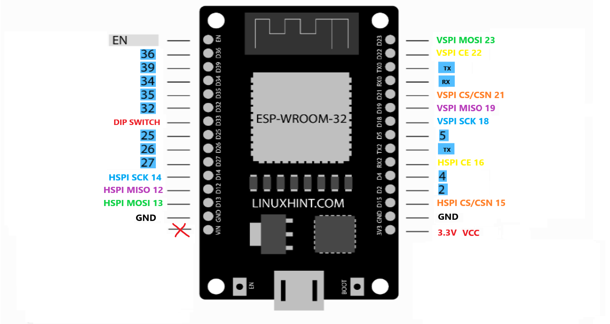

**WARNING!!! JAMMING IS ILLEGAL**
 ---
# WHAT DOES IT DO?
**IT CREATES NOISE SIGNAL TO JAM BLUETOOTH AND WIFI USING NRF24L01 AND ESP32 IN RANGE 2.4GHZ DEVICES, EFFECTS MAY VARY DEPENDS ON DEVICE BLUETOOTH VERSIONS **

`NOT TESTED ON 2.4GHZ DRONE I DONT HAVE ONE BUT IT CAN JAM ONE..... MAYBE?` 
---
## REQUIRED DEVICE AND MODULE:
1. `1pc OR 2pcs NRF24`
- Buy link: https://s.shopee.vn/AKPbm6iKfB
  
  

2. `1pc ESP32`
- Buy link: https://s.shopee.vn/5fdmDlb45J
  
  

3. `10UF-100UF CAPACITOR DEPEND ON YOUR NRF`
- Buy link: https://s.shopee.vn/8fHNnW7y1h

  

4. `1 DIP SWITCH` (OPTIONAL IF YOU WANT TO USE DIFFERENT PATTERN OF CHANNEL HOPPING)
- Buy link: https://s.shopee.vn/5L0vpYAdVs
  
  
---

## PINS TO ATTACH NRF24L01 TO ESP32
### NRF24L01 (YOU CAN CHOOSE BETWEEN HSPI, VSPI OR BOTH)
+ ` HSPI: SCK = 14, MISO = 12, MOSI = 13, CS = 15, CE = 16`
+ ` VSPI: SCK = 18, MISO = 19, MOSI = 23, CS = 21, CE = 22`

### SWITCH PIN (OPTIONAL)
- `PIN 33 OF YOUR ESP32 `
---

## WIRING DIAGRAM
### NRF24L01 PINS
  

### ESP32 PINS WHERE YOU ATTACH YOUR `NRF24` AND `SWITCH `
  

### HOW YOU ATTACH CAPACITOR LOOK OUT FOR POLAROITY SIGNS `- +`
  
--- 

## UPLOADING CODE TO ESP32
- ` WEBFLASHER `INSTALLER FOR EASY UPLOAD CODE ON ESP32 NO NEED TO DOWNLOAD INO FILE (USE CHROME OR EDGE BROWSER)

- [https://dtavnn.github.io/esp32-Bluetooth-jammer](https://dtavnn.github.io/esp32-Bluetooth-jammer/)
---

## TESTED
+ **TESTED 10 METERS ON BLUETOOTH 5.0 AND WORKS GREAT**
+ **TESTED 10 METERS ON NEWER BLUETOOTH 5.3 WORKING DEPENDS BETWEEN THE GAP OF BLUETOOTH DEVICE AND PHONE**
+ **IF YOU WANT BETTER PERFORMANCE YOU CAN ADD 2.4GHZ RF AMPLIFIER** 
---

# DONATION
**If you like, you can donate to MY PAYPAL ACCOUNT :**  
[PAYPAL](https://paypal.me/dtavnn) or [MOMO](assets/momo.jpg)  

- QR MOMO:  
 

